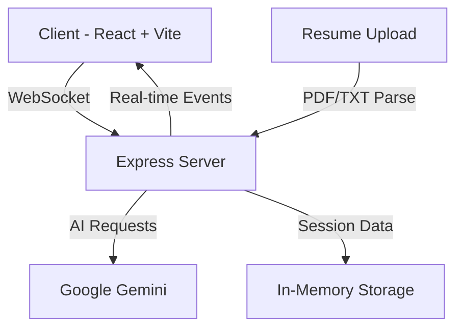

# InterviewPilot 🎯


> AI-powered mock interview platform with real-time transcript, feedback and scoring using Google Gemini.

## 🚀 Features

- 🤖 Real-time AI interviews powered by Google Gemini
- 📝 Live transcription and instant feedback
- 📊 Dynamic scoring and performance analytics
- 📎 Resume parsing for personalized questions
- 🔄 WebSocket-based real-time communication
- 🎯 Tailored technical assessment workflows

## 🛠️ Tech Stack

- **Frontend**: React 18, Vite, Tailwind CSS, Radix UI (shadcn/ui), Framer Motion
- **Backend**: Express, WebSocket, TypeScript
- **AI Engine**: Google Gemini (gemini-2.5-flash and gemini-flash-lite-latest)
- **Database**: Drizzle ORM
- **Build Tools**: esbuild, Vite

## 📦 Installation

```bash
# Clone the repository
git clone https://github.com/BeenAAAA/interviewpilot.git

# Install dependencies
cd interviewpilot
npm install

# Set up environment variables
cp .env.example .env
# Add your GEMINI_API_KEY to .env
# Get your API key from: https://aistudio.google.com/app/apikey
```

## 🚀 Quick Start

```bash
# Development mode
npm run dev

# Production build
npm run build

# Start production server
npm start

# Type checking
npm run check

# Database schema updates
npm run db:push
```

## 🏗️ Architecture



## 💡 Usage

1. Start the server and frontend
2. Upload your resume (PDF/TXT)
3. Configure interview parameters
4. Begin mock interview session
5. Receive real-time feedback and scoring
6. Review performance analytics

## ⚙️ Environment Variables

| Variable | Description | Required |
|----------|-------------|----------|
| `GEMINI_API_KEY` | Google Gemini API Key ([Get one here](https://aistudio.google.com/app/apikey)) | Yes |
| `PORT` | Server Port (default: 5000) | No |

## 🧰 Key Components

- **Real-time Interview Engine**: WebSocket-based communication
- **Resume Parser**: Extracts relevant information for personalized questions
- **AI Question Generator**: Creates contextual interview questions
- **Feedback Analyzer**: Provides instant response assessment
- **Session Manager**: Handles interview state and progression
- **Type-safe Communication**: Shared TypeScript schemas

## 🔒 Type Safety

```typescript
// Example of shared type definitions (shared/schema.ts)
interface InterviewSession {
  id: string;
  status: 'pending' | 'active' | 'completed';
  score: number;
  feedback: Feedback[];
}

interface Feedback {
  timestamp: number;
  message: string;
  score: number;
}
```

## 🤝 Contributing

Contributions are welcome! Please feel free to submit a Pull Request.

## 📄 License

This project is licensed under the MIT License - see the [LICENSE](LICENSE) file for details.

## 🙏 Acknowledgments

- Google Gemini team for the AI capabilities
- The React and TypeScript communities
- All contributors and users of InterviewPilot

---

Made with ❤️ by [BeenAAAA](https://github.com/BeenAAAA)
But Realisticly speaking it was made with tolerance from [Claude](https://github.com/Claude) (We ❤️ you Claude!)
